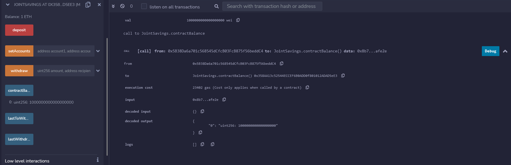
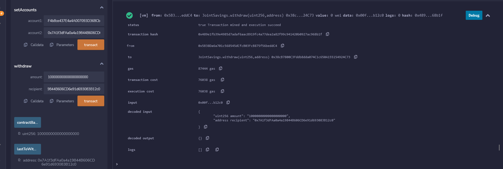

# **Fintech Bootcamp Challenge 20**
---

---
Developed smart contracts to automate several financial processes and features, such as hosting joint savings accounts. Automated the creation of joint savings accounts. Created a Solidity smart contract that accepts two user addresses. These addresses are able to control a joint savings account. The smart contract uses ether management functions to implement a financial institution’s requirements for providing the features of the joint savings account. These features consist of the ability to deposit and withdraw funds from the account.

---

## **Technologies**
---
#### **Technologies Used**:
- Solidity notebook
- Etherium blockchain technology
- Solidity programming language
- REMIX IDE

---

## **Usage**

---
The Contract allows two accounts to complete financial operations in the joint account, such as deposit and withdraw Ether coin.

---
## **Results:**

Transaction 1: Send 1 ether as wei:

---

Transaction 2: Send 10 ether as wei:

---

Transaction 3: Send 5 ether:

---

Transaction 4: Withdraw 5 ether into Acct 1:

---

Transaction 5: Withdraw 10 ether into Acct 2:

---
LastToWithdraw & lastWithdrawalAmount:

---
## **Contributors**

- ggorovod01@gmail.com

## **License**

MIT

